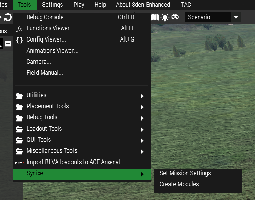
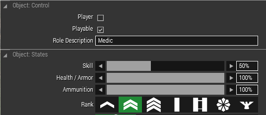
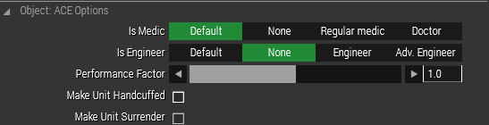
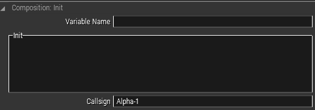
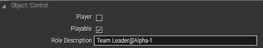

# Mission Guide

## Required
Before reading this document, players should already be familiar with being Zeus. Gameplay aspects of mission making will not be covered in this guide.

# Basic Setup

## Required

The first thing to do when creating a new mission is to run both of the Synixe Tools. They can be found under `Tools -> Synixe`.



Every mission requires a name, author, and a description.  

Names can be found under `Attributes > General | Presentation > Title`  
Valid characters are: [A-z 0-9 - /] and space.

Author can be found under `Attributes > General | Presentation > Author`

Description can be found under `Attributes > General | Overview > Text`

## Unit Setup

Every unit requires
- A role description
- Not marked as Player
- Marked as Playable



Additional ACE options can be specified



## Group Setup

Groups must follow a specific structure, this is required by the Synixe mod as it does automatic radio configuration based on the groups.

To setup a squad `Alpha` with 3 fireteams you must have the following:

Alpha
  - Squad Leader@Alpha  

Alpha-1
  - Team Leader@Red
  - Slot
  - Slot
  - Slot

Alpha-2
  - Team Leader@Green
  - Slot
  - Slot
  - Slot

Alpha-3
  - Team Leader@Blue
  - Slot
  - Slot
  - Slot

### Callsign

Each playable group must have a valid callsign. Callsigns must follow the format above. A list of valid callsigns can be found [in the Synixe mod](https://github.com/Synixe/Synixe/blob/master/addons/radios/ACRE.hpp).



### Pretty Name

The leader of each group must have `@` followed by their group's pretty name. The pretty name can be any name, as long as the first word is unique to that mission.



<span style="color:green">Valid</span>
```
@Alpha-1      [Alpha-1-1]
@Alpha-2      [Alpha-2-1]
@Alpha-3      [Alpha-3-1]
```

<span style="color:green">Valid</span>
```
@Red          [Red-1]
@Green        [Green-1]
@Blue         [Blue-1]
```

<span style="color:green">Valid</span>
```
@Red Team     [Red-1]
@Green Team   [Green-1]
@Blue Team    [Blue-1]
```

<span style="color:red">Invalid</span>
```
@Group A      [Group-1]
@Group B      [Group-1]
@Group C      [Group-1]
```

<span style="color:green">Valid</span>
```
@Group-A      [Group-A-1]
@Group-B      [Group-B-1]
@Group-C      [Group-C-1]
```
