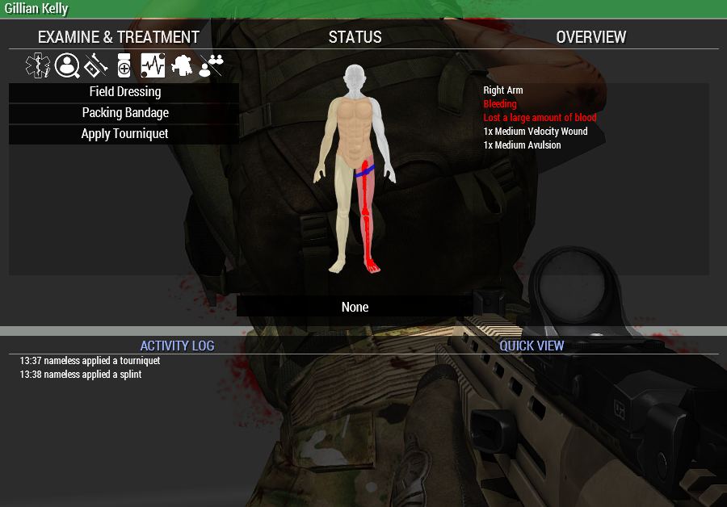

# Medical

## Rifleman

### UI

When treating yourself or another, it's highly recommended to use the Medical Menu accessible by pressing `H` instead of using the interaction menu.

Colors and icons on the paper doll represent:

 - Light yellow to dark red: bleeding wound(s), darker means faster bleed rate
 - Dark blue: bandaged wound(s)
 - Light blue: stitched
 - Red bone: limb is fractured
 - Blue line: limb has a tourniquet applied temporarily stopping bleeding  

Wounds are prefixed to indicate if they're bandaged [B] or stitched [S] under Overview in the Medical Menu.

### Fractures

- A direct hit to a limb has a chance to cause a fracture, a fractured limb will cause you to be at a severe disadvantage.
- Be it limping for legs, or severe aim sway for arms, the only way to treat a fracture is with a splint.
- Splints are single use, anyone can apply one to themselves or others.

Fractured limbs have a unique icon on the paper doll and a specific set of sounds when they happen, if left untreated fractured limbs ***induce severe amounts of pain.***

### Damage

A direct hit to the head or torso (heart) without proper protection equipment is directly fatal and will send you straight to the spectator screen for the rest of the operation.

## Medics

### Vitals

- Pain is now part of the vitals loop, meaning that pain caused by an injury will affect heart rate
- Severe amounts of pain and blood loss can cause the heart rate to reach extremely high values and make the patient run the risk of entering cardiac arrest
- In these scenarios Adenosine can be used to reduce the heart rate while open wounds are treated, Morphine could also be used but it has a much longer time in system than Adenosine

With bleeding being more severe, cardiac arrest scenarios are common. Learning to treat them accordingly will be necessary.

**The first signs of trauma induced cardiac arrest are:**

- Large amount of blood loss
- Heart rate will quickly rise, at this stage IVs and possibly adenosine could save the patient
- Heart rate and blood pressure read 0, at this point you have little time to save patient

Once a patient enters cardiac arrest your best bet is having multiple people working on the patient, one being assigned to procuring CPR non-stop until heart rate returns, others treating open wounds; providing IVs and checking other vitals.

### Misc

Extra knowledge that may prove useful on the field:

- You bandage others faster than bandaging yourself, medics treat faster overall
- Medics can self-transfuse IVs
- Medics can self stitch
