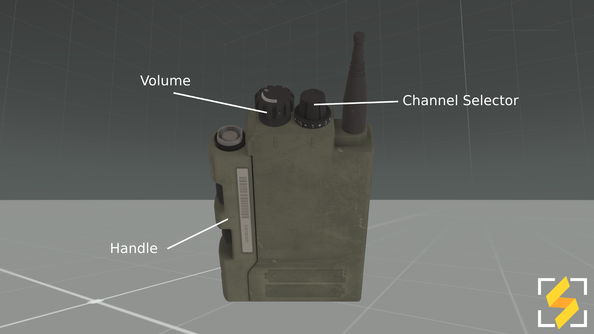
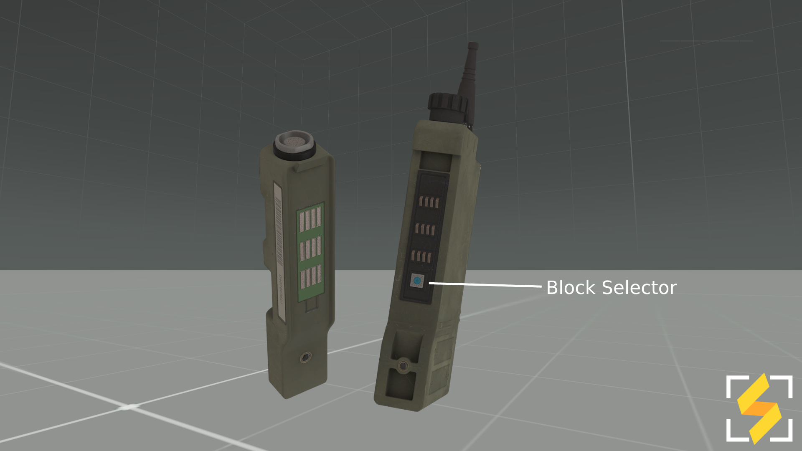
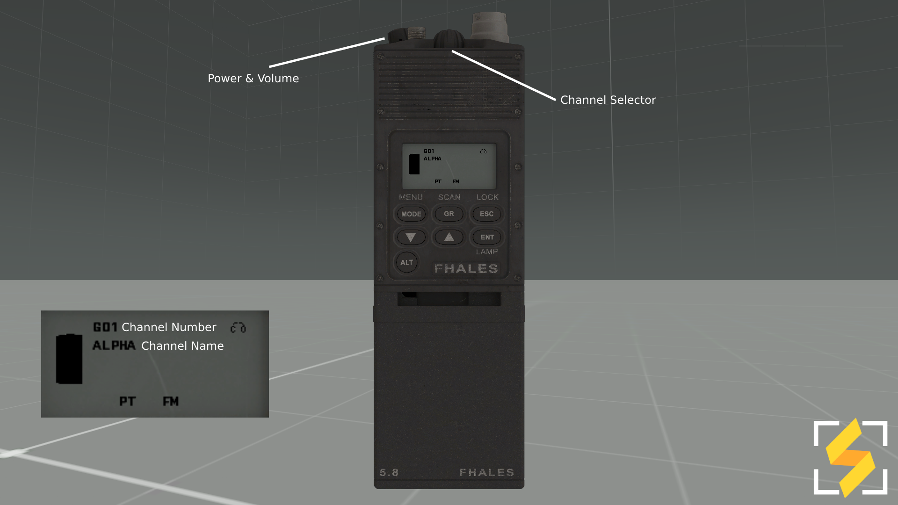
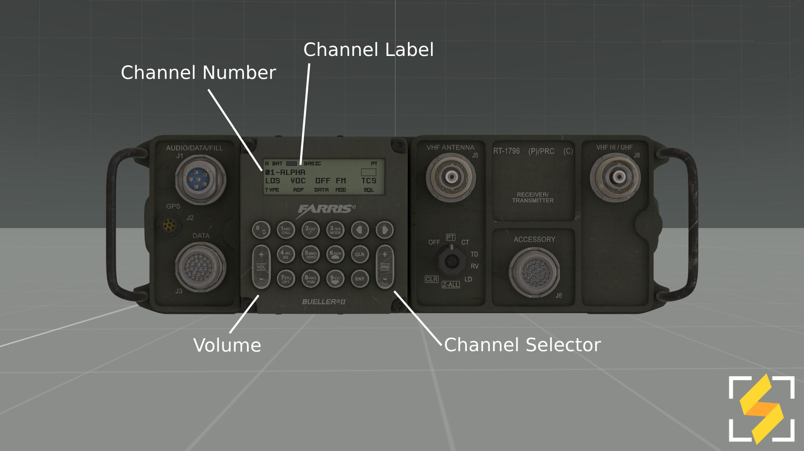

# ACRE Radios
This page will go over the handling and operation of ACRE radios for the Synixe Gaming Community.

# Mechanics
## Proximity Speech 
ACRE has a built in proximity speech slider allowing you to set how far you can be heard. The system has five volume states which starts in the middle state by default (3/5).

| Volume state | Loud (m) | Quiet (m) | Barely audible (m)
| --- | --- | --- | --- 
| 1/5 | 1 | 2 | 13
| 2/5 | 3 | 15 | 55
| 3/5 | 8 | 30 | 100
| 4/5 | 12 | 45 | 145
| 5/5 | 15 | 55 | 195 

Holding down <code>tab</code> while scrolling up or down will adjust your volume state by 1. Scrolling up will make your voice louder to be heard from further while scrolling down will make your voice quieter as shown on the table. Once you set your volume state you can release <code>tab</code>.
 

    

## Radio Ranges
|     Radio    |  City Range  |  Perfect Range  |
| :----------: | :----------: | :-------------: |
|  AN/PRC-343  |     450m     |      850m       |
|  AN/PRC-148  |     3-5km    |      5-7km      |
|  AN/PRC-117F |    10-20km   |     Horizon     |

## Terrain & Object Interference 
When operating radios behind hills and in urban environments with many objects radio strength and range will be reduced compared to if you were operating the radio in open terrain or on top of a building.

# Controls
Pressing `capslock` will transmit through the AN/PRC-343.  
Pressing `ctrl + capslock` will transmit through the AN/PRC-148.  
Pressing `alt + capslock` will transmit through the AN/PRC-177F.

When using the radio a click sound will be played to indicate you are transmitting and in the bottom right of the screen an image will appear showing what channel you are transmitting to. To finish your transmission let go of `capslock`.

When interacting with ACRE radios there are two ways to bring up their interface to change the channel / frequency:
* Double clicking the radio within your inventory 
* Self interacting via ACE 

# AN/PRC-343 Usage
The AN/PRC-343 is a short range intra-team personal level radio commonly carried and used by members within a team to communicate with one another. 

<b>Usage Demonstration (Video)</b>

<iframe width="540" height="540" src="https://www.youtube.com/embed/tRoBLWNabCw" frameborder="0" allow="accelerometer; autoplay; encrypted-media; gyroscope; picture-in-picture" allowfullscreen></iframe>

## Volume Control
Left clicking the volume knob increases the 343's volume by 20% to a maximum of 100% while right clicking will decrease the volume by 10% to a minimum of 0% which will turn off the radio.

## Channel & Block Control
To change the 343's channel you left click or right click the channel knob to increase or decrease the channel by 1 up to 16 channels.

To change the block channel number you'll need to open the 343's Handle (as shown in the photo)

When the Handle is opened you left click or right click the Channel Block knob (blue dot) to increase or decrease the channel block's by 1 for up to 16 blocks. Once you've set your block number reattach the Handle (otherwise radio will cease to function) and transmit to check what frequency you are transmitting on.

    

# AN/PRC-148 Usage
The AN/PRC-148 is a long range intra-squad level radio carried and used most commonly by [Team Leaders](/guides/players/teamlead.md) to communicate with one another.

## Volume Control
Left clicking the Power & Volume knob will increase the 148's volume by 10% to a maximum of 100% while right clicking will decrease the volume by 10% to a minimum of 0% which will turn off the radio.

## Channel Frequency Control
To change the 148's channel you left click the Channel Selector to cycle up to the next callsign (Alpha > Bravo > Charlie) and right clicking will cycle down to the next callsign (Charlie > Bravo > Alpha). There are 12 channels that Synixe uses, channels 1-7 are Alpha > Foxtrot while channels 8-12 are special channels such as ATC, Medical, Command, etc.

# AN/PRC-117F, AN/VRC-103
The AN/PRC-117 (or its vehicle configuration AN/VRC-103) is a long range command level radio carried in a backpack (or pre-mounted in vehicles) used by Squad Leaders, Command and Support elements to communicate with one another. 
 
## Volume Control
Clicking on the `+` on the radio will increase the volume of the 117F by 10% to a maximum of 100%, clicking on the `-` will decrease the volume by 10% to a minimum of 20%. 
## Channel Frequency Control
To change the 177F's channel you click on the `+` in the Channel Selector to switch up to the next callsign (Alpha > Bravo > Charlie) and clicking `-` on the channel selector will switch down to the next callsign (Charlie > Bravo > Alpha). There are 12 channels that Synixe uses, channels 1-7 are Alpha > Foxtrot while channels 8-12 are special channels such as ATC, Intel, Command, etc.

# Advanced Reading
Further information for the advanced features of ACRE Radios can be found [here](http://acre2.idi-systems.com/wiki/radios/overview) as some of these features Synixe are unlikely to use in the scope of our operations.