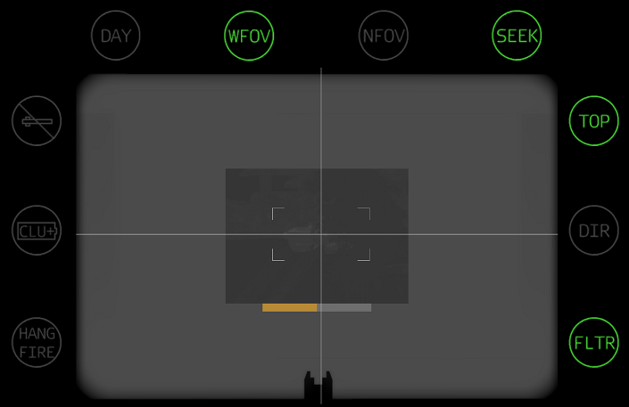

# Titan MPRL Compact
The Titan Compact is a shouldered fire-and-forget missle launcher capable of firing Anti-Tank (AT) and Anti-Personnel (AP) muntions.

## Missile Type

### Anti-Tank

Anti-Tank (AT) missiles require a thermal target to lock on to, and will seek the target after launch.

1. Switch to thermal view with `N`
2. Center target in viewfinder, zoom in with `+ [NUM]` if target is far
3. Hold `Tab`
4. Wait for lock tone and `SEEK`
5. Fire with `Left Click`

  
Missile Locking

  
Missile Locked

### Anti-Personnel

Anti-Personnel (AP) missiles are fly-by-wire. They are fired without a locked target and continue towards the center of the view finder.

1. Center target in viewfinder
2. Fire with `Left Click`, zoom in with `+ [NUM]` if target is far
3. Track target with viewfinder
4. Observe impact

## Attack Profile

Attack profiles can be switched by hitting `F`

### Top

The missile will fly higher and hit the top of the target.

### Direct

The missile will fly directly to the target.

