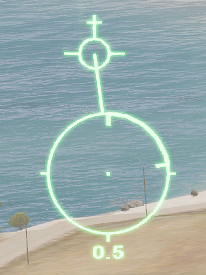

# Fixed Wing Pilots

This guide will only cover the use of NATO equipment.

# Basics

This guide will not cover the basics of flight, and only covers operations.

## HMD

1. Roll Indicator
2. Flight Information
3. VSI - Vertical Speed Indicator
4. Altimeter
5. Center Point
6. Artificial Horizon
7. Current Vector
8. See Targeting > Unguided
9. Last Lockable Laser Direction
10. Visible Laser
11. Current Weapon
12. Remaining Ammo
13. Heading

## Pylons

### Air-to-Air

- AIM-9L Sidewinder  
  Short range, IR-guided
- AIM-120  
  Medium range, radar-guided

### Air-to-Surface
- Hydra 70 HE  
  Unguided rocket, HE
    - Infantry Groups  
    - Light Vehicles
- Hydra 70 AP  
  Unguided rocket, anti-tank
    - Medium Vehicles  
    - Light Armor
- DAGR  
  Short range, laser/IR guided, anti-tank
    - Heavy Vehicles  
- 9K121 Vikhr  
  Short range, laser/IR guided, anti-tank
    - Medium Vehicles  
    - Light Armor
- AGM-114K [ACE]  
  Long range, laser guided (hellfire), high explosive anti-tank
    - Heavy Armor
- AGM-114N [ACE]  
  Long range, laser guided (hellfire), thermobaric
    - Enclosures
    - Ships
    - Urban targets
    - Air defense units
- Mk82  
  500lb, unguided
- GBU-12  
  500lb, laser guided, high explosive

## Targeting

### Unguided (Propelled)

The estimated location of impact and time of flight in seconds are indicated in the HMD.

### Unguided

The estimated location of impact and the time of flight in seconds are indicated in the HMD.

This is obviously a bad idea when using a bomb, as it requires the pilot to be low or diving. The estimated location can also be seen from the underbelly camera marked by a small crosshair.

If the location of impact is obstrcuted the crosshair will be overlayed with a cross.

### Laser / IR Guided (Propelled)

Available targets in range are marked with a square with solid corners.

Targets must be hot on IR (engine on) in order to be locked. While being locked a repeating tone is heard as a diamond closes in on the target square. Once locked a solid tone and a square and diamond are over the target.

### Hellfire

While using a hellfire compatible missile, addition information is displayed under the weapon info panel.

1. Attack profile
2. Laser code
3. LOBL status (Lock-On-Before-Launch)

Laser codes can be used to hit multiple targets at a time, or to hit a specific target when multiple lasers are being used.

The hellfire missiles have 4 attack profiles.

1. LOBL | Lock-On-Before-Launch
2. LOAL-DIR | Missile flies with a low altitude until acquiring a laser
3. LOAL-LOW | Missile immediately gains ~90m altitude
4. LOAL-HI | Missile immediately gains ~300m altitude

LOBL is only available when the LOBL status indicator is lit red.

