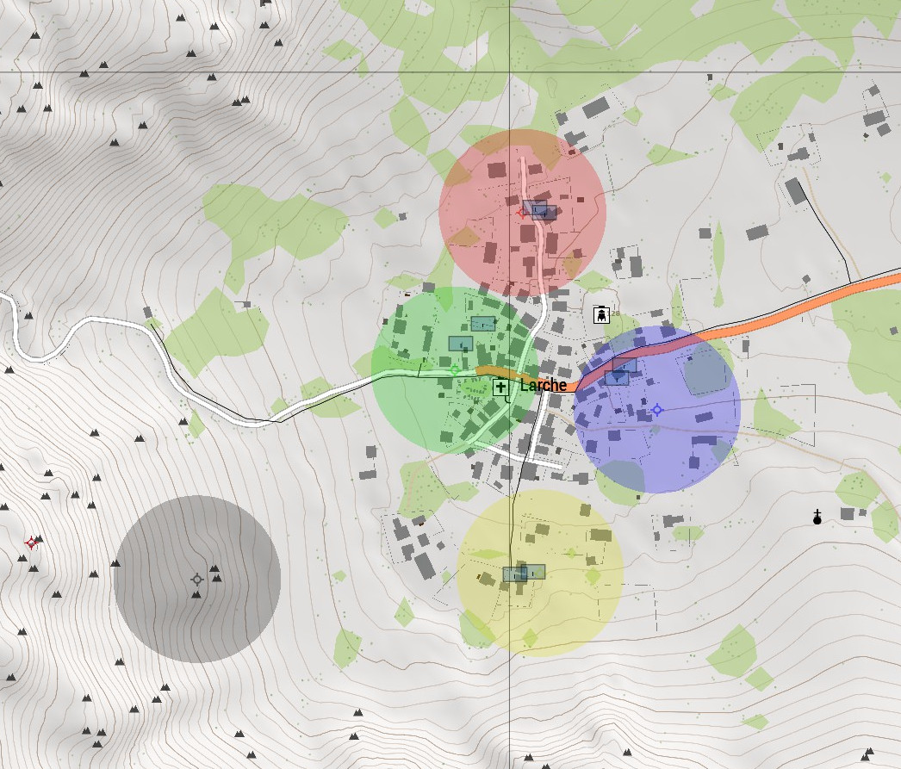
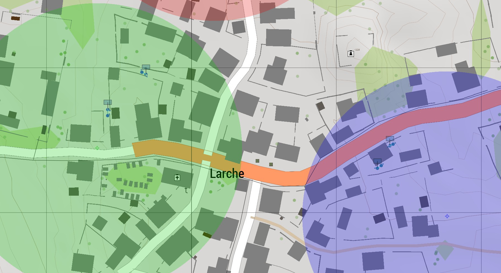

# Power of 10 Rule
## Basic Principle
Each person is responsible for the 10m around them.  
Teams are responsible for the 100m around them.  
Squads are responsible for the 1km around them.  

Teams / Squads should avoid entering the area of another element

## Reasoning
This system ensures that everyone inside a given space has a quick way to contact the people around them. This system won't allow two people to be on opposite sides of a street without having a direct way to contact the other.

It prevents friendly fire incidents because teams / squads know what is in their AO and special care can be taken when this rule needs to be breached.

A squad with 4 teams clears buildings in a town

