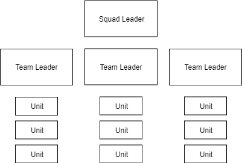

# Rule of 3

## Basic Principle
Each person should only be in charge of three other people or elements.  
SL has a max of 3 teams  
TL has a max of 3 rifleman  
## Reasoning
This structure splits the workload of organizing a squad over multiple people with easy to manage sizes. It also allows people to try playing as TL without having a large number of players to manage.

